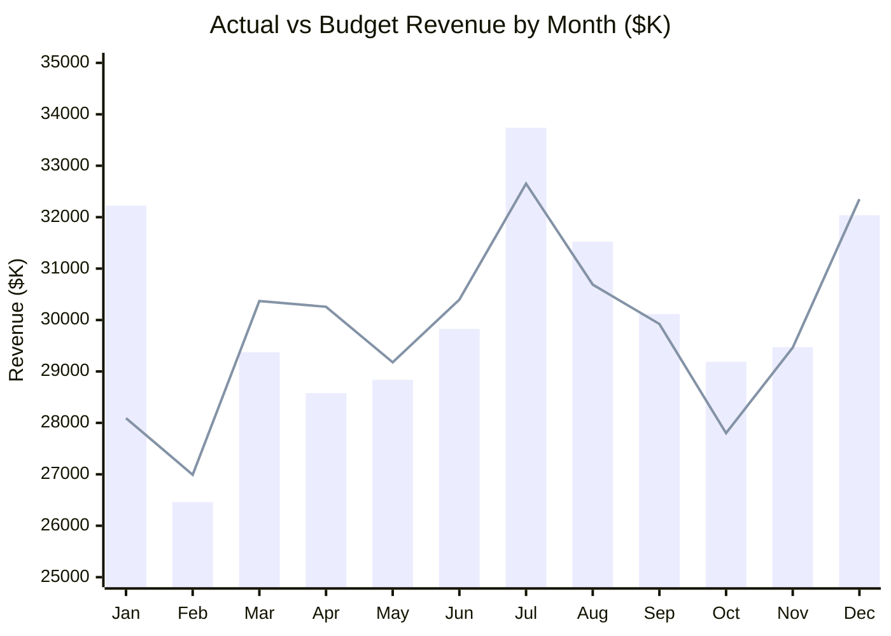
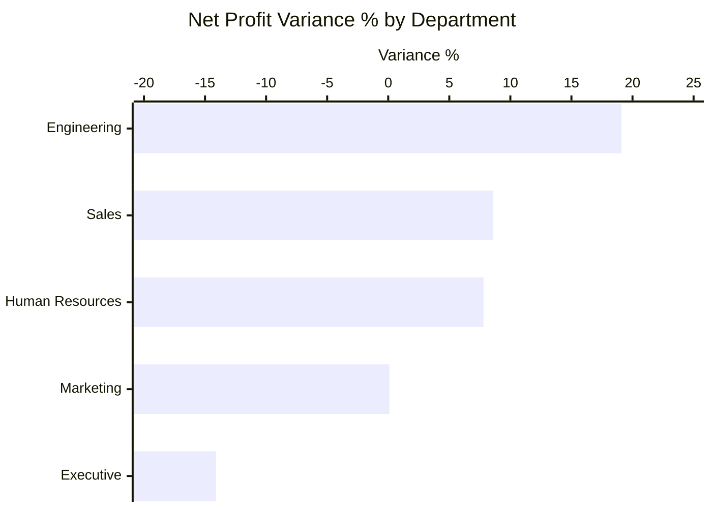
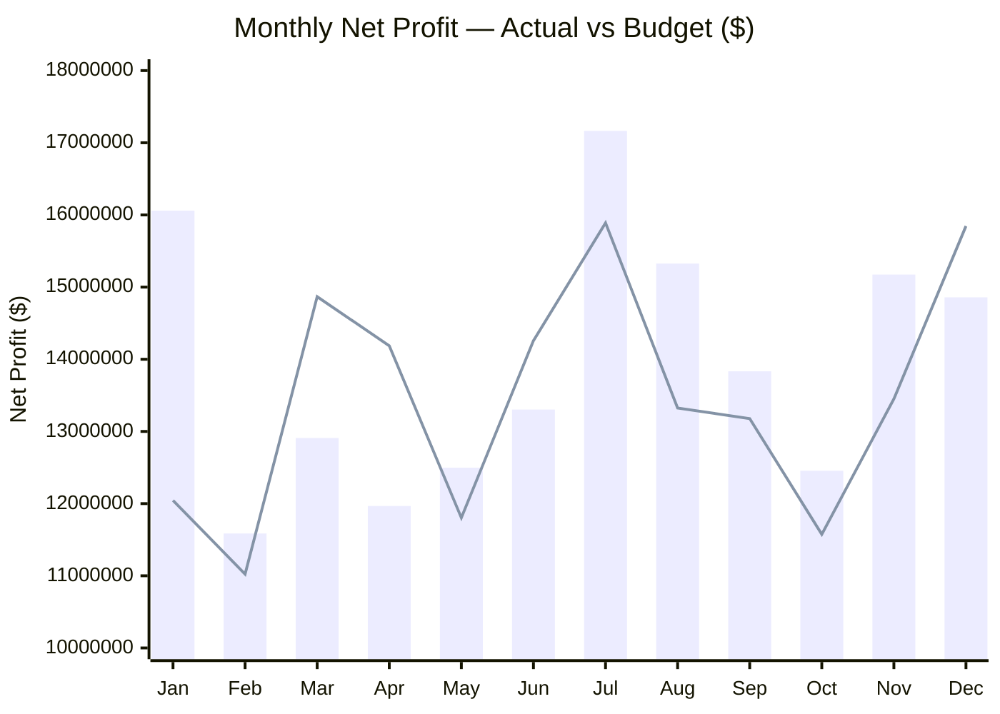
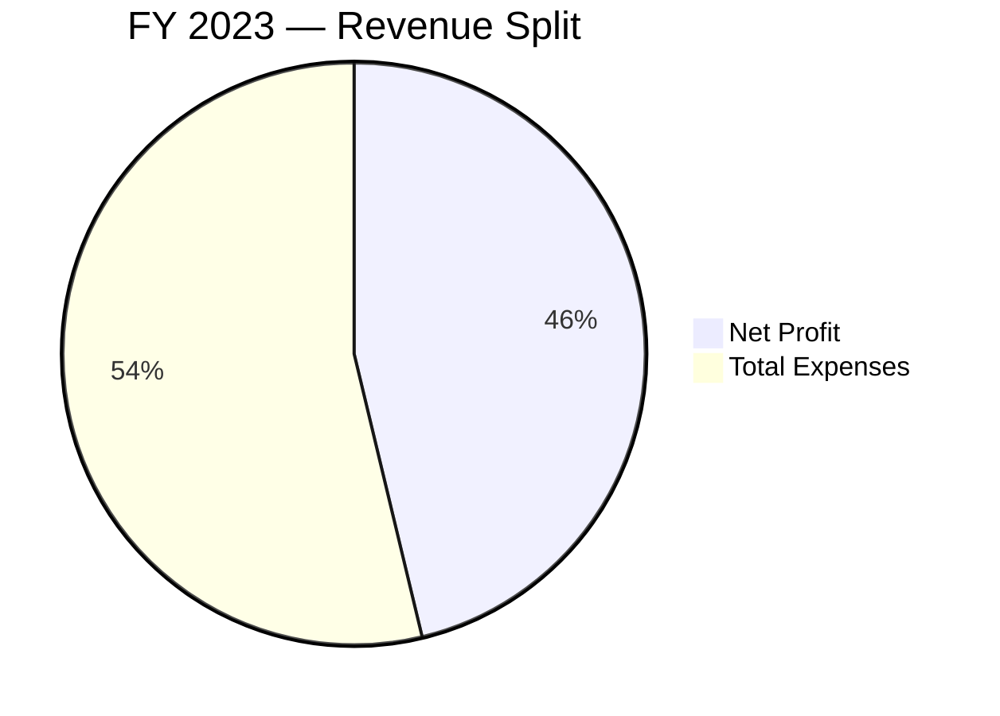
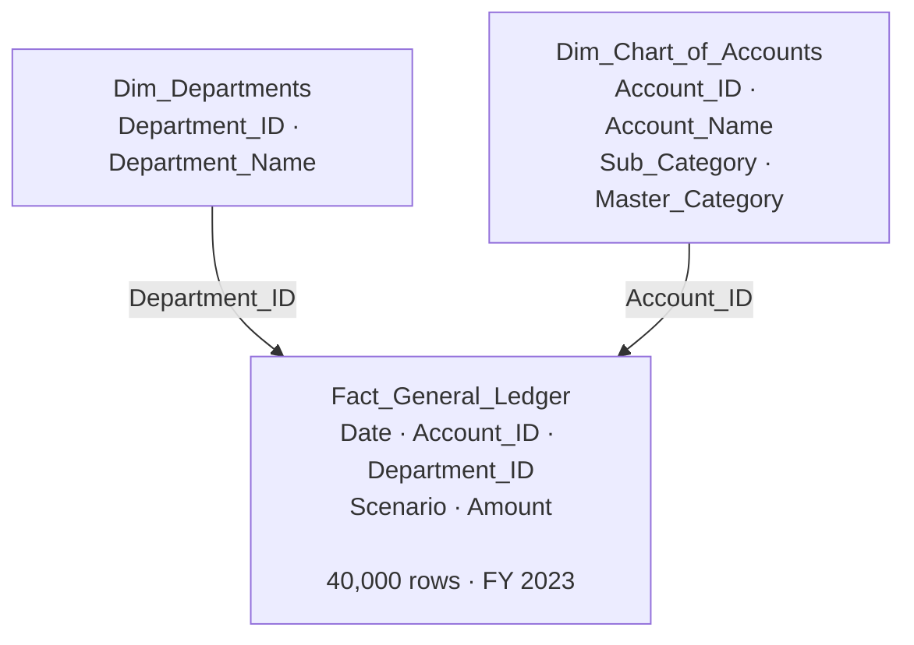
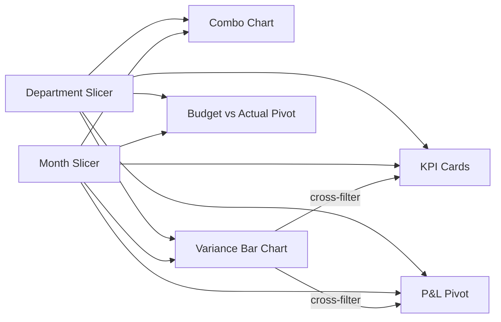

# Budget Variance Analysis Dashboard — Power BI

[](www.linkedin.com/in/kaif-mahaldar-18300b333)


The question this dashboard answers is simple: we know we're ahead of budget, but where exactly? A single percentage doesn't help anyone act on anything. This breaks it down by department, by month, by account. Built on 40,000 rows of general ledger data across five departments and twelve months.

---

## What I found

- The business finished FY 2023 at +3.5% above budget net profit. That's +$5.7M. Sounds clean until you look at the departments.
- Engineering overdelivered by 19.1%. Sales and HR both came in around +8%. Marketing hit almost exactly on budget.
- Executive was the only department to miss. At -14.1%, it dragged $4.9M off the total. Without it, the company number would've been closer to +7%.
- January and July were the two strongest months on both revenue and profit.
- March and April were the soft spots. Both fell short of budget on revenue and net profit.

---

## What's in this repo

```
budget-variance-analysis-powerbi/
│
├── Dataset/
│   ├── Fact_General_Ledger.csv
│   ├── Dim_Chart_of_Accounts.csv
│   └── Dim_Departments.csv
│
├── Report/
│   └── Budget_Variance_Dashboard_FY2023.pbix
│
└── README.md
```

---

## The two pages

###  Executive KPI Summary

Four KPI cards at the top. Monthly trend chart and department variance chart side by side. Full P&L table at the bottom. Both slicers filter everything on the page at the same time. It's meant to be the view you keep open in a meeting.


---

### Departmental Drill-Down

Same numbers, different layout. This one is for going deeper. Pick a month or a range of months on the left. Click a department in the bar chart and the whole page filters to just that department. Two clicks from "Executive missed" to "here's which accounts."


---

## The numbers

| Metric | Value |
|---|---|
| Actual Revenue | $361,381,293 |
| Actual Expenses | $194,246,928 |
| Actual Net Profit | $167,134,365 |
| Budget Net Profit | $161,446,627 |
| Variance $ | +$5,687,738 |
| Variance % | +3.5% |

46 cents of every revenue dollar ends up as net profit. That's a healthy number for a services business.

---

## Revenue vs Budget by Month



Bars = Actual. Line = Budget.


---

## Department Variance



| Department | Actual Net Profit | Budget Net Profit | Variance $ | Variance % |
|---|---|---|---|---|
| Engineering | $32,966,779 | $27,670,252 | +$5,296,527 | +19.1% |
| Sales | $35,272,985 | $32,475,661 | +$2,797,324 | +8.6% |
| Human Resources | $34,596,732 | $32,105,951 | +$2,490,781 | +7.8% |
| Marketing | $34,084,545 | $34,035,272 | +$49,273 | +0.1% |
| Executive | $30,213,324 | $35,159,491 | -$4,946,167 | -14.1% |
| **Total** | **$167,134,365** | **$161,446,627** | **+$5,687,738** | **+3.5%** |


---

## Net Profit vs Budget by Month



Bars = Actual. Line = Budget.

January was the best month. $16M actual against a $12M budget. March, April, and June were the three months that came in under plan.

---

## Where the revenue goes




---

## How the data model works

Three tables. One fact, two dimensions.



The `Scenario` column does most of the work. Both Actual and Budget numbers live in the same fact table, just tagged differently. Every measure has an Actual version and a Budget version. The variance is just the gap between them.

---

## DAX measures

```
Actual Net Profit   = Actual Revenue - Actual Expenses
Budget Net Profit   = Budget Revenue - Budget Expenses
Net Profit Var $    = Actual Net Profit - Budget Net Profit
Net Profit Var %    = DIVIDE([Net Profit Var $], ABS([Budget Net Profit]))
```

---

## How the interactivity works



Both slicers hit everything. On Page 2, clicking a bar in the department chart also cross-filters the table and cards. So the whole page becomes about that one department.

---

## What's coming next

- **Executive deep dive page** — Pages 1 and 2 show that Executive missed by -14.1%. The next page would show exactly which sub-categories and accounts caused it. That's the question this data raises and doesn't fully answer yet.
- **Bookmarks** — saved views for All Departments, Under-Budget Only, and H2 only. So anyone using the report can jump between states without touching the slicers.

---

## Assumptions

- Budget and Actual are in the same fact table, separated by the Scenario column
- Net Profit is calculated. It's not a standalone column in the source data.
- The P&L hierarchy goes Master Category to Sub-Category to Account Name
- All figures in USD, full calendar year 2023

---

## Tools

Power BI Desktop · DAX · Power Query


**Role: Data Analyst ** 

 
 **Others Project -**
 
 
1) https://github.com/Kaif39211/pharmaceutical-inventory-analysis-SQL 

                                              
                                              
2) https://github.com/Kaif39211/KM_Logistics_2022_Analysis.xlsx
                                             
                                              
    
     
 3) https://github.com/Kaif39211/zepto_inventory_analysis.sql

                      


## **Contact: [LinkedIn](http://www.linkedin.com/in/kaif-mahaldar-18300b333) | [Email](mailto:kaifmahaldar5@gmail.com)**

